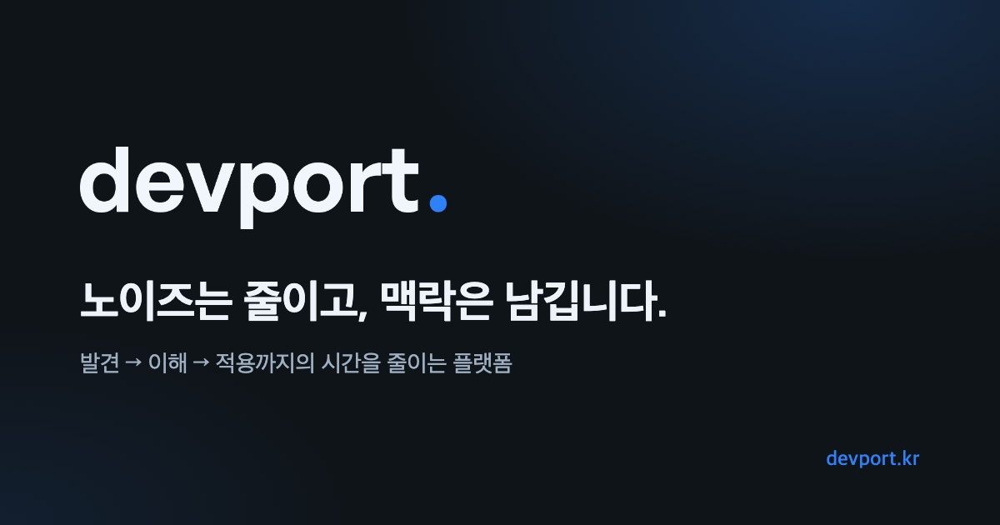

  

# devport
화제가 된 개발 소식을 모아 한국어로 정리하는 서비스입니다.

[devport.kr](https://devport.kr) · [블로그](https://devport.kr/blog) · [문의 및 제보](https://github.com/devport-kr/devport-web/issues)

---

## 왜 devport인가

개발 생태계의 새로운 흐름은 대부분 영어권에서 시작됩니다. 매일 새로운 글과 토론, 오픈소스 프로젝트, 모델 벤치마크가 쏟아지지만 정보는 여러 플랫폼에 흩어져 있고, 원문을 모두 읽지 않으면 무엇이 중요한지 판단하기 어렵습니다.

devport는 이 정보를 한곳에 모으고, 맥락까지 한국어로 읽을 수 있게 정리합니다. 무엇이 화제인지 훑어보는 데서 끝나지 않고, 왜 중요한지와 어떤 프로젝트를 살펴봐야 하는지까지 이어서 이해할 수 있도록 돕습니다.

### 개발 뉴스

해외 커뮤니티와 기술 블로그에서 반응이 큰 글을 골라 한국어 제목과 본문 요약으로 제공합니다. AI/LLM, DevOps/SRE, Infra/Cloud, Backend, Frontend, Security 등 12개 카테고리로 분류하고, 반응과 최신성을 반영한 점수로 정렬합니다. 모든 글에는 원문 링크가 함께 제공됩니다.

### 트렌딩 리포지토리

GitHub에서 빠르게 성장 중인 오픈소스 프로젝트를 한국어 요약과 함께 소개합니다.

### Ports

주목받는 AI 오픈소스 프로젝트를 프로젝트별 한국어 위키로 정리합니다. 코드를 읽기 전에 프로젝트의 목적과 구조, 주요 변화를 먼저 파악할 수 있고, portki 챗봇에게 프로젝트에 대해 바로 질문할 수 있습니다.

### LLM 랭킹

주요 LLM의 벤치마크 점수를 종합 지능, 에이전틱, 추론, 코딩, 수학 등 영역별로 비교합니다. 이미지·영상 생성 모델의 ELO 기반 순위도 함께 제공합니다. 데이터 출처는 [Artificial Analysis](https://artificialanalysis.ai/)입니다.

### 검색과 개인화

키워드 검색과 자동완성으로 지난 글을 다시 찾을 수 있습니다. 로그인하면 글 저장, 읽은 기록, 댓글, 뉴스레터 구독을 이용할 수 있습니다.

## 피드백

버그 제보와 기능 제안은 [Issues](https://github.com/devport-kr/devport-web/issues)로 남겨 주세요. 서비스 안에서도 하단의 제보 링크로 바로 의견을 보낼 수 있습니다.

## 라이선스

MIT License

---

Maintained by [@BrianKim913](https://github.com/BrianKim913)
